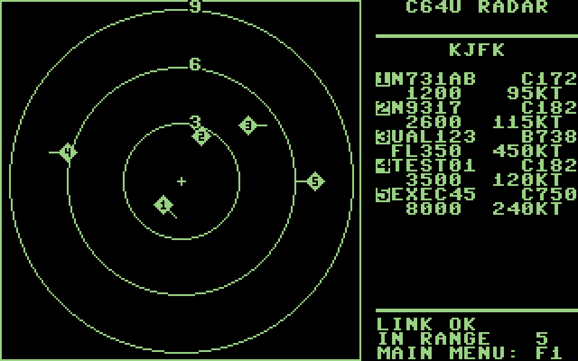

# C64U Radar

A **Commodore 64** live radar scope for **ADS-B air traffic**, powered by
[adsb.fi OpenData](https://github.com/adsbfi/opendata).

**No PC server needed** — the C64 talks directly to adsb.fi over HTTPS
using a **Meatloaf** IEC device with its built-in HTTP client and JSON
Pointer extraction.  The Python bridge server and Ultimate-II+ UCI
register interface have been eliminated.



## Hardware requirements

| Component | Requirement |
|-----------|-------------|
| **Commodore 64** | Any PAL or NTSC C64 (no Ultimate Cartridge needed) |
| **IEC device** | Meatloaf (or compatible) with full-mode HTTP + TLS firmware |
| **Network** | Ethernet (via Meatloaf) with internet access |

## How it works

```text
adsb.fi OpenData API (HTTPS)
    ↑ /v3/lat/{lat}/lon/{lon}/dist/{dist}
    |
Meatloaf (IEC device #8, sec addr 2, full-mode HTTP)
    ↑ cbm_open / cbm_write / cbm_read (JSON Pointer queries)
    |
C64U Radar (c64u_radar.prg)
    ↓
VIC-II hires bitmap scope + 8 hardware sprites
```

1. **Menu** — enter a latitude/longitude or a 4-letter ICAO airport code.
   Airport codes resolve from a built-in table of ~280 major airports
   (generated from the OurAirports database).
2. **Fetch** — the C64 opens an HTTPS URL to adsb.fi v3 through Meatloaf.
3. **Extract** — Meatloaf caches the JSON response; the C64 issues JSON
   Pointer (`j`) queries for each aircraft's `dst`, `dir`, `track`,
   `flight`, `t` (type), `alt_baro`, and `gs` — one field per query.
4. **Project** — positions are converted to 0..199 pixel coords using
   fixed-point sin/cos lookup tables (1° resolution, scaled by 127).
5. **Display** — up to 8 targets as numbered diamond sprites with
   direction stems on a 200×200 px radar scope, plus a side-panel table
   of callsign, type, altitude, and ground speed.

## Quick start

1. **On the C64**: load and run `c64u_radar.prg`.  No cartridge or
   server setup is required — just Meatloaf on the IEC bus.
2. **Pick a center**: choose latitude/longitude or a 4-letter ICAO
   airport code.  The C64 fetches live traffic from adsb.fi directly.

## Build

Requires [cc65](https://cc65.github.io/) on PATH.

```sh
cd c64u_radar
make clean all
```

Produces `c64u_radar.prg` (~19K) and `c64u_radar.map`.  The build fails
if program/data exceeds the `$5A00` sprite memory block (checked by
`check_map.py`).

### Host-side test (no C64 needed)

```sh
cd c64u_radar
make host_test
./host_test/harness
```

Builds the same source natively against a fake 64K RAM plane and a mocked
Meatloaf device.  Runs coordinate validation, airport lookup, sprite
pattern, and link-down tests, then dumps binaries for preview renderers.

## Repository layout

```text
c64u_radar/          C64 program source (cc65), Makefile, host-side tests
assets/              Screenshots
```

## Memory map

```text
$5A00  sprite patterns (512 bytes)
$5C00  screen matrix (1000 color cells)
$6000  bitmap (8000 bytes)
$8000  charset copy (2048 bytes)
$8800  rowbase table (100 bytes)
$8900  blob buffer (232 bytes, LD wire format)
$8A00  URL buffer (~72 bytes)
$8A60  scope labels (28 bytes)
$8A80  JSON Pointer buffer (~32 bytes)
$8AC0  JSON value buffer (~36 bytes)
```

Program+data ends at `$53AA` — well below the `$5A00` sprite area.

## Data source

https://opendata.adsb.fi/ — public ADS-B data.  Personal non-commercial
use.  Rate limit: 1 req/s (public tier); the C64 polls every ~10 s.

## Credits

- Traffic data: [adsb.fi](https://adsb.fi/).
- Airport coordinates: [OurAirports](https://ourairports.com/data/) (public domain).
- Meatloaf IEC HTTP client: [meatloaf-dev](https://github.com/meatloaf-dev).

## License

GPL-3.0 — see LICENSE.
